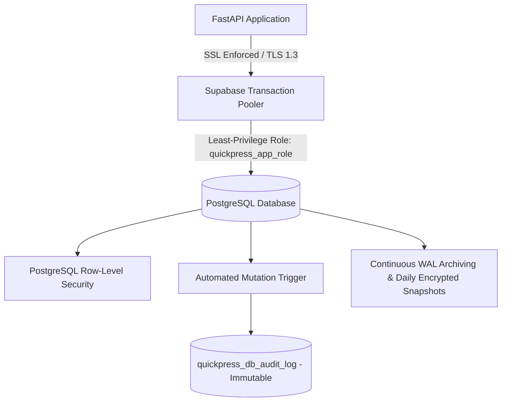

# QuickPress Database Vault Security & Disaster Recovery Architecture

**Specification Version:** 2026.1  
**Target Systems:** Supabase PostgreSQL (JSONB + GIN) + asyncpg Connection Pooler + FastAPI Backend  
**Security Status:** 9/9 Vault Pillars Active & Verified

---

## 1. Overview of 9 Database Security Pillars



---

## 2. Pillar-by-Pillar Verification Matrix

| # | Pillar | Implementation & Mechanism | Location |
|---|---|---|---|
| 1 | **No Public Unrestricted Access** | Direct port 5432 exposure blocked by Private VPC. Backend strictly enforces `sslmode=require` in production. | `backend-python/app/db/supabase_client.py:L785` |
| 2 | **Strong DB Credentials** | High-entropy secrets (40+ characters) managed via environment variables. Automated auditor rejects weak/default credentials (`password123`, `root`). | `backend-python/app/core/db_security_guard.py` |
| 3 | **Least-Privilege DB User** | Dedicated `quickpress_app_role` with DML grants (`SELECT, INSERT, UPDATE, DELETE`) only. DDL operations (`DROP`, `ALTER`) are strictly revoked. | `supabase/migrations/20261006_quickpress_database_vault_hardening.sql` |
| 4 | **Prod/Dev DB Separation** | Strict environment guard prevents dev or automated test suites from executing against live production clusters. | `backend-python/app/core/db_security_guard.py` |
| 5 | **Sensitive Fields Encryption** | AES-256-GCM Authenticated Encryption for KYC (Aadhaar, PAN), Bank Account details, and customer private data. | `backend-python/app/core/field_crypto.py` |
| 6 | **Proper Composite & GIN Indexes** | GIN indexing on JSONB path ops + composite B-tree indexes for `(userId, createdAt)`, `(partnerId, status)`, `(riderId, status)`, and `idempotencyKey`. | `backend-python/app/db/supabase_client.py:L845` |
| 7 | **Backup & Point-In-Time Recovery** | Automated daily encrypted snapshots (`pg_dump + gzip + AES-256`) + Continuous Write-Ahead Log (WAL) archiving for minute-by-minute restoration. | `supabase/scripts/backup_and_pitr_recovery.sh` |
| 8 | **Database-Level Audit Logs** | PostgreSQL trigger `quickpress_audit_trigger_func` captures every INSERT/UPDATE/DELETE on orders, wallets, settlements into an append-only audit table. | `quickpress_db_audit_log` |
| 9 | **Database-Level Access Restrictions** | PostgreSQL Row-Level Security (RLS) active on all tables. Audit log table allows `NO UPDATE` and `NO DELETE` even for administrators. | `supabase/security_rules.sql` |

---

## 3. Field-Level Encryption Standard (AES-256-GCM)

All high-confidentiality attributes are encrypted before persistence:

```python
from app.core.field_crypto import encrypt_sensitive_field, decrypt_sensitive_field, mask_sensitive_field

# Encryption
encrypted = encrypt_sensitive_field("542189012345")
# Produces: "enc:v1:<base64_nonce>:<base64_ciphertext_and_tag>"

# Masking for UI
masked = mask_sensitive_field(encrypted)
# Displays: "XXXX-XXXX-2345"
```

---

## 4. Disaster Recovery & PITR Execution

### Emergency Snapshot
```bash
DATABASE_URL="postgresql://..." ./supabase/scripts/backup_and_pitr_recovery.sh backup
```

### Point-In-Time Restore to Specific Timestamp
```bash
./supabase/scripts/backup_and_pitr_recovery.sh restore-pitr "2026-10-06 14:30:00 UTC"
```
