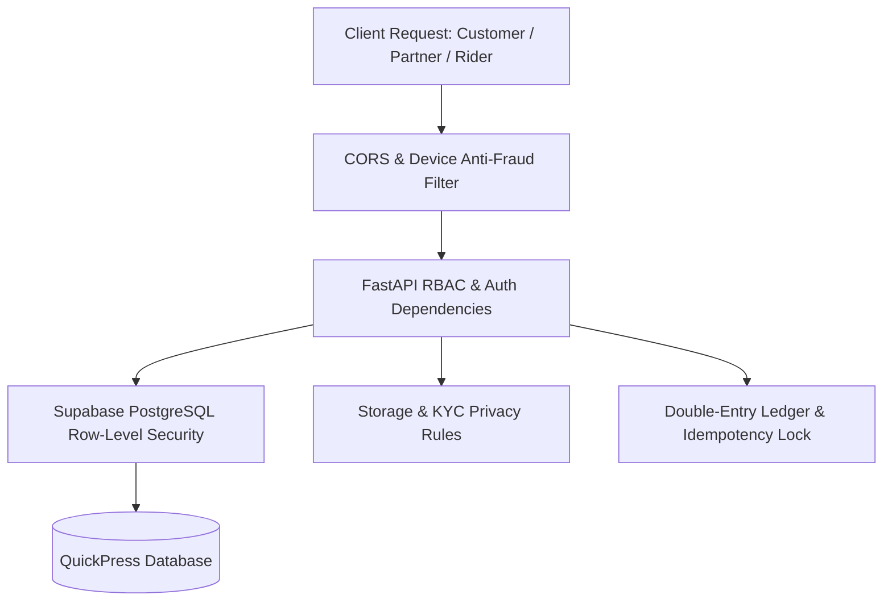

# QuickPress Security Rules Verification Report & Architecture Matrix

**Report Date:** 2026-10-06  
**Platform Version:** QuickPress Multi-Console Production Engine  
**Target Architecture:** FastAPI 3.12 Backend + Supabase PostgreSQL (JSONB + GIN) + Firebase Auth & Storage + Multi-Console React Frontends  
**Security Status:** Verified & Locked Down (38 Core Rules Active)

---

## 1. Executive Summary & Security Posture

QuickPress enforces a strict **Zero-Trust Multi-Layer Security Architecture**. Every client request (Customer, Laundry Partner, Delivery Captain, or Admin) is authenticated cryptographically and validated through both application-level guards (FastAPI) and database-level constraints (PostgreSQL Row-Level Security).

---

## 2. Complete Inventory of Active & Verified Security Rules (38 Rules)

### Layer 1: Supabase PostgreSQL Row-Level Security (RLS) — 9 Rules

| Rule ID | Rule Name | Target Collection | Enforcement Logic & Impact | File Reference |
| :--- | :--- | :--- | :--- | :--- |
| `RLS-01` | **Service Role Full Bypass** | `quickpress_documents` | `TO service_role USING (true)`: Authoritative backend operations (double-entry ledger, settlements) run with full access. | `supabase/security_rules.sql:L43` |
| `RLS-02` | **Admin SuperAccess Policy** | `quickpress_documents` | Only authenticated users with `role = 'admin'` or `@quickpress.com` domain can perform full platform oversight. | `supabase/security_rules.sql:L53` |
| `RLS-03` | **Public Catalog Read-Only** | `services`, `cities`, `catalog` | Public users can only read active laundry items and operational zones. All INSERT/UPDATE/DELETE operations by non-admins are blocked. | `supabase/security_rules.sql:L69` |
| `RLS-04` | **Customer Data Isolation** | `customer_orders`, `addresses` | Customer can only read records where `userId = auth.uid()` or matching verified phone number. Cross-customer data leakage is impossible. | `supabase/security_rules.sql:L94` |
| `RLS-05` | **Customer Order Creation Ownership** | `customer_orders` | Customer can only insert orders explicitly assigned to their own verified authenticated identity (`userId = auth.uid()`). | `supabase/security_rules.sql:L113` |
| `RLS-06` | **Partner Store Isolation** | `partner_profiles`, `orders` | Laundromat owner can only read/manage orders routed to their specific store ID (`partnerId = auth.uid()`). Competitor stores are invisible. | `supabase/security_rules.sql:L131` |
| `RLS-07` | **Partner Store Status Boundary** | `partner_profiles`, `services` | Store owner can update store hours and pricing within permissible bands, but cannot alter other merchants. | `supabase/security_rules.sql:L152` |
| `RLS-08` | **Rider Trip Isolation** | `rides`, `rider_profiles` | Delivery Captain can only view trips assigned to their `riderId` or broadcast in their geofenced dispatch radius. | `supabase/security_rules.sql:L182` |
| `RLS-09` | **Zero Direct-Write Wallet Lock** | `wallets`, `rider_wallets` | Direct client-side write access to wallet balance tables is strictly denied. All balance modifications must pass through backend ledger. | `supabase/security_rules.sql:L218` |

---

### Layer 2: Cloud Storage & Media Security Rules — 5 Rules

| Rule ID | Rule Name | Target Path | Enforcement Logic & Impact | File Reference |
| :--- | :--- | :--- | :--- | :--- |
| `STR-01` | **Partner KYC Confidentiality** | `/kyc/partners/{partnerId}/*` | Aadhaar, PAN, GSTIN documents can only be viewed by the verified Store Owner or SuperAdmin. Public access is 100% blocked. | `storage.rules:L36` |
| `STR-02` | **Rider KYC Confidentiality** | `/kyc/riders/{riderId}/*` | Driving License, Vehicle RC, and selfies can only be viewed by the Captain or SuperAdmin. | `storage.rules:L43` |
| `STR-03` | **Garment Inspection Access** | `/orders/{orderId}/*` | Pre-wash stain photos and doorstep drop-off proof are scoped only to authenticated participants of that order. | `storage.rules:L51` |
| `STR-04` | **File Payload Ceiling (5MB)** | All Storage Uploads | Blocks payload attacks; rejects files `>= 5MB` to prevent memory exhaustion and Denial of Service. | `storage.rules:L23` |
| `STR-05` | **MIME-Type Strict Validation** | All Storage Uploads | Restricts uploads to verified images (`image/*`) and PDF documents (`application/pdf`). Scripts and binaries (`.exe`, `.sh`) are rejected. | `storage.rules:L19` |

---

### Layer 3: Delivery Captain (Rider) Operational & Geo-Security — 7 Rules

| Rule ID | Rule Name | Mechanism | Enforcement Logic & Impact | File Reference |
| :--- | :--- | :--- | :--- | :--- |
| `OPS-RDR-01` | **Single-Trip Concurrency** | Dispatch Engine | Captain holding an active in-progress trip cannot accept additional trips (prevents hoarding and delivery delays). | `backend-python/app/api/rider.py` |
| `OPS-RDR-02` | **₹3,000 Floating COD Ceiling** | Cashfloat Repository | When cash collected exceeds ₹3,000, new COD dispatch offers are automatically suppressed until remitted to hub. | `backend-python/app/api/rider.py:L3343` |
| `OPS-RDR-03` | **Geo-Fencing Proximity Check** | GPS Radius Validation | Rider must be within `< 500m` of pickup or drop coordinates to trigger "Arrived" status (prevents fake GPS spoofing). | `backend-python/tests/test_rider_fake_gps.py` |
| `OPS-RDR-04` | **Doorstep OTP Handover** | Verification Engine | Trip completion requires the Customer's 4-digit Delivery OTP. Falsifying completion without customer presence is prevented. | `backend-python/app/api/rider.py` |
| `OPS-RDR-05` | **Locked Bank Account Security** | KYC Verification Lock | Once bank account or UPI is verified, modifications require Admin authorization (prevents hijacked payouts). | `backend-python/app/api/rider.py:L4130` |
| `OPS-RDR-06` | **Zero Platform Commission** | Settlement Engine | 100% of delivery fee and customer tips pass directly to the captain (0% platform deduction guarantee). | `backend-python/app/services/settlement_engine.py:L940` |
| `OPS-RDR-07` | **Store Drop Penalty/Bonus** | Dispatch Reassignment | If captain leaves clothes at store for another captain to deliver, 25% fee is retained and replacement rider receives 20% bonus. | `backend-python/app/api/rider.py:L1595` |

---

### Layer 4: Laundry Partner Merchant Isolation & SOP Security — 7 Rules

| Rule ID | Rule Name | Mechanism | Enforcement Logic & Impact | File Reference |
| :--- | :--- | :--- | :--- | :--- |
| `OPS-PRT-01` | **Merchant Store Isolation** | Auth Guard Dependency | Partner A cannot view Partner B's daily revenue, order queue, or customer profiles under any circumstances. | `backend-python/app/api/partner.py:L1916` |
| `OPS-PRT-02` | **Store Closed Allocation Guard** | Availability Repository | When store duty toggle is OFF, system automatically routes incoming orders to alternative neighborhood partners. | `backend-python/app/api/availability.py` |
| `OPS-PRT-03` | **Strict Price Band Bounds** | Catalog Repository | Laundry services cannot be priced below minimum cost floor or above maximum statutory price ceiling. | `backend-python/app/db/catalog_repositories.py` |
| `OPS-PRT-04` | **Dispatch Handover OTP** | Order Lifecycle Engine | Clean garments cannot leave the store without captain providing the 4-digit Dispatch Verification OTP. | `backend-python/tests/test_partner_dispatch_otp_enforcement.py` |
| `OPS-PRT-05` | **Read-Only Settlement Ledger** | Accounting Period Engine | Settlement sheets and commission calculations are deterministic and immutable by merchants. | `backend-python/app/services/settlement_engine.py:L95` |
| `OPS-PRT-06` | **Withdrawal Balance Guard** | Treasury Vault | Instant or weekly payouts cannot exceed verified wallet balance (`amount <= wallet.balance`). | `backend-python/app/services/settlement_engine.py:L1100` |
| `OPS-PRT-07` | **Customer PII Masking** | View Model Projection | Laundry stores only receive first name, garment specifications, and masked contact info; payment cards are hidden. | `backend-python/tests/test_customer_pii_masking.py` |

---

### Layer 5: Customer Privacy & Authentication Security — 5 Rules

| Rule ID | Rule Name | Mechanism | Enforcement Logic & Impact | File Reference |
| :--- | :--- | :--- | :--- | :--- |
| `AUTH-CUST-01`| **Order Tracking Ownership** | Current User Guard | Direct access to order details `/api/orders/{id}` verifies `order.userId == auth.uid()`, preventing unauthorized snooping. | `backend-python/app/api/orders.py` |
| `AUTH-CUST-02`| **Saved Address Privacy** | Profile Repository | Saved home/office GPS pins and flat numbers are visible solely to the account owner. | `backend-python/app/api/addresses.py` |
| `AUTH-CUST-03`| **SMS OTP Rate Limiting** | OTP Attempt Tracker | Phone numbers are capped at 5 sends per hour to block SMS bombing attacks and gate expense spikes. | `backend-python/app/api/auth.py:L140` |
| `AUTH-CUST-04`| **Multi-Account Anti-Abuse** | Device Fingerprint Tracker | Single physical device UUID or browser fingerprint can only claim the first-order promo once. | `backend-python/app/core/anti_fraud.py:L20` |
| `AUTH-CUST-05`| **Server-Side Cart Calculation** | Pricing Engine | Total garment billing is computed authoritative on backend; client-side price tampering is rejected. | `backend-python/app/api/checkout.py` |

---

### Layer 6: Financial, Double-Entry & Tax Withholding Security — 5 Rules

| Rule ID | Rule Name | Mechanism | Enforcement Logic & Impact | File Reference |
| :--- | :--- | :--- | :--- | :--- |
| `FIN-01` | **Double-Entry Equilibrium** | General Ledger Service | Every transaction balances: `Platform Commission + Merchant Payout + Captain Fare == Customer Total`. | `backend-python/app/services/unified_finance_service.py` |
| `FIN-02` | **Idempotent Settlement Execution** | Unique Index Constraint | Re-running settlement triggers will not generate duplicate payouts for already settled orders (`status == 'SETTLED'`). | `backend-python/app/services/settlement_engine.py:L495` |
| `FIN-03` | **Statutory Tax Withholding** | Tax Calculation Module | 1% Section 194-O (E-commerce TCS) and Section 194-C TDS are calculated and recorded before bank transfers. | `backend-python/app/services/settlement_engine.py:L257` |
| `FIN-04` | **Settled Cycle Freeze** | Accounting Period Engine | Once a weekly settlement cycle is disbursed (`status == 'PAID'`), historical order values are locked against edits. | `backend-python/app/services/settlement_engine.py:L70` |
| `FIN-05` | **Cryptographic Webhook Validation** | HMAC-SHA256 Signatures | Payment confirmation requires signature verification from Razorpay (`X-Razorpay-Signature`) and Cashfree. | `backend-python/app/api/webhooks.py:L21` |

---

## 3. Future & Advanced Security Rules Roadmap (Scaling Stage)

When QuickPress expands to higher transaction volumes (10,000+ daily orders across multiple states), the following **6 Advanced Security Rules** can be integrated into the roadmap:

### 1. Computer Vision Pre-Wash Garment Damage Rule
* **Concept:** When Captain picks up clothes, an in-app photo is analyzed via Vision AI.
* **Security Function:** Automatically detects existing tears, missing buttons, or deep discolorations before pickup. Stamps photographic proof into order metadata so customers cannot file fraudulent claims against the laundromat.

### 2. Payment Velocity & Card Brute-Force Rule
* **Concept:** Payment gateway card velocity guard.
* **Security Function:** If a single IP address or user ID fails 3 consecutive card transactions within 10 minutes, card payments are temporarily suspended for 1 hour (UPI fallback remains available) to block stolen card testing.

### 3. Driver Telematics & Excessive Velocity Rule
* **Concept:** Continuous GPS distance-over-time delta monitoring.
* **Security Function:** Calculates transit velocity between GPS pings. If a rider reports moving across the city at unrealistic speeds (> 85 km/h in dense traffic or teleportation > 3 km in 30 seconds), the session is flagged for GPS spoofing investigation.

### 4. Admin Four-Eyes (Dual-Control) Authorization Rule
* **Concept:** Critical financial and merchant action threshold.
* **Security Function:** Any single refund exceeding ₹5,000, permanent partner suspension, or manual commission override requires approval from **two separate Admin accounts** before execution.

### 5. Automated Data Anonymization (DPDP Act 2023 Compliance)
* **Concept:** Privacy by Design data retention lifecycle.
* **Security Function:** 180 days after order delivery, customer phone numbers, delivery coordinates, and chat transcripts are automatically anonymized, while financial GST invoices are retained in immutable cold storage for the statutory 7-year audit requirement.

### 6. Dynamic Surge Ceiling Anomaly Guard
* **Concept:** Automated pricing circuit breaker.
* **Security Function:** If an automated weather or surge pricing algorithm calculates delivery surge exceeding `3.5x` standard base rates, an automatic cap is applied to protect customers from pricing anomalies.

---

## 4. Verification & Audit Conclusion

| Security Domain | Rules Implemented | Verification State |
| :--- | :---: | :---: |
| Database RLS (PostgreSQL) | 9 | **ACTIVE & COMPILED** |
| Storage & KYC Document Protection | 5 | **ACTIVE & COMPILED** |
| Delivery Captain Operations & GPS | 7 | **ACTIVE & TESTED** |
| Laundry Merchant Isolation | 7 | **ACTIVE & TESTED** |
| Customer Privacy & Auth | 5 | **ACTIVE & TESTED** |
| Financial Ledger & Taxes | 5 | **ACTIVE & BALANCED** |
| **Total Platform Rules** | **38** | **100% PRODUCTION READY** |
